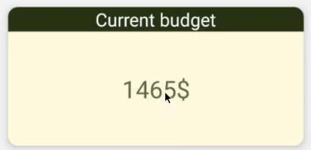
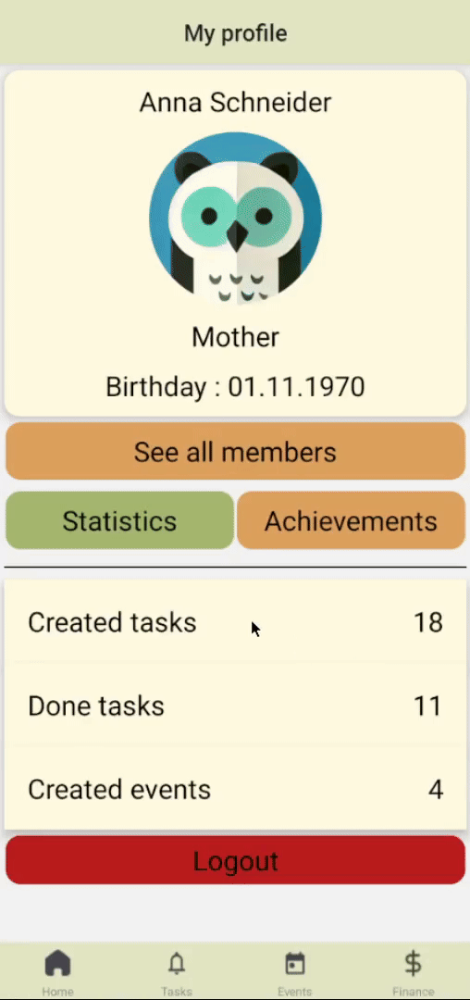
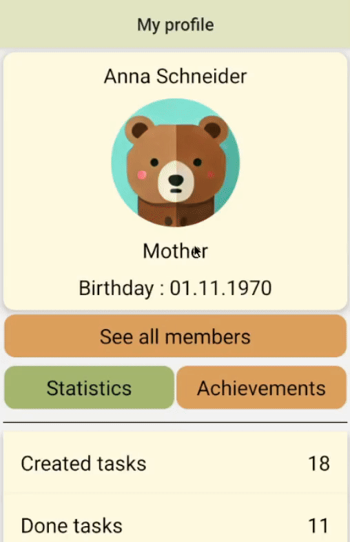

# My part of implementation

Main parts that i have implemented:

- Simplified account login
- Navigation
- Finance page
- Profile page

# Navigation
I used `@react-navigation` library to implement navigation in our application. Navigation allows you to switch between the following pages: home, tasks, events, finance and profile.

  

# Finance page
### Budget inline editing

  

# Profile page
Each family member can see his own profile and the profile of other family members. In each profile, you can track activity in the application and various achievements.

  

### Change profile picture
Each family member can change their profile picture

  

