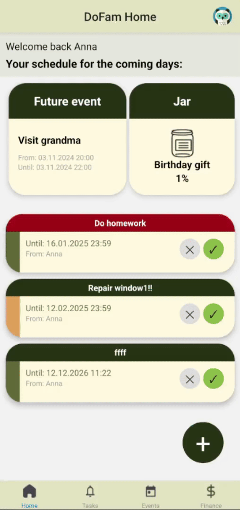

# Build
Our application is using Expo:
```console
$ npm install
...
$ npx expo start
...
```

# My part of implementation

Main parts that i have implemented:

- Simplified account login
- Navigation
- Finance page
- Profile page

# Navigation
I used `@react-navigation` library to implement navigation in our application. Navigation allows you to switch between the following pages: home, tasks, events, finance and profile.
<p align="center">
  
</p>

# Finance page
### Budget inline editing
The family budget can be directly changed by clicking on the value of the current budget.
<p align="center">
  
</p>

### Adding transaction
A transaction can be added from the finance page by clicking **Add** button.
<p align="center">
  
</p>

### Deleting transaction
A transaction can be deleted from the transactions page by clicking the cross button. A transaction can be also deleted from certain jar page.
<p align="center">
  
</p>

### Filtering transaction
Transactions can be filtered from the transactions page.
<p align="center">
  
</p>

### Creating and deleting jar
A jar can be created on the home page and finance page, and can also be deleted on a jar page.
<p align="center">
  
</p>

### Adding an amount to a jar
There are two ways to add an amount to the jar, from the finance page and from the page of this jar.
<p align="center" justify="center">
  
  
</p>

### Updating deadline of jar
Jar deadline can be updated from its own page.
<p align="center">
  
</p>

### Jar inline editing
Some information about jar can be directly changed by clicking on the value.
<p align="center">
  
</p>

# Profile page
Each family member can see his own profile and the profile of other family members. In each profile, you can track activity in the application and achievements.
<p align="center">
  
</p>

### Change profile picture
Each family member can change their profile picture.
<p align="center">
  
</p>